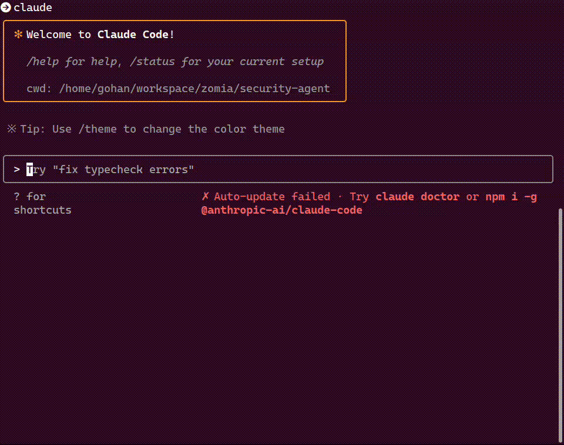

# Security Agents - Multi-Phase Security Analysis System

An automated security analysis system using Claude Code for comprehensive Bug Bounty research and vulnerability assessment.

## Overview

This system performs multi-phase security analysis for blockchain projects, specifically designed for Bug Bounty programs. It uses Claude with WebSearch capabilities to analyze Bug Bounty scopes, technical specifications, and generate attack scenarios.

## How to use

### Generate Callgraph (Optional)
```bash
uv sync
uv run python -m utils.static_analyzer .. --verbose
```

### Launch Claude Code

```
claude --dangerously-skip-permissions
```

Use custom slash commands for each task:



---

## Call Graph Visualization

Navigate to the callgraphs directory and visualize specific contracts:

```bash
cd outputs/callgraphs

# Generate PNG images for key contracts
dot -Tpng PoolManager.call-graph.dot -o PoolManager.png
dot -Tpng all_contracts.call-graph.dot -o all_contracts.png
dot -Tpng Hooks.call-graph.dot -o Hooks.png
dot -Tpng Pool.call-graph.dot -o Pool.png

# Generate SVG for interactive viewing
dot -Tsvg all_contracts.call-graph.dot -o all_contracts.svg

# Generate PDF for documentation
dot -Tpdf PoolManager.call-graph.dot -o PoolManager.pdf
```

## Requirements

- **Graphviz**: Required for DOT file visualization
  ```bash
  # Ubuntu/Debian
  sudo apt install graphviz

  # macOS
  brew install graphviz

  # Verify installation
  dot -V
  ```